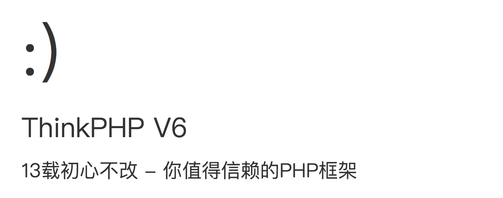

# 安装

首先创建基于tp6.0的项目,环境要求参考官方信息    
以下安装过程，基于composer，假若不了解composer建议谷歌或者百度    

#### 创建thinkphp6.0项目

```
composer create-project topthink/think tp
```

由于Swoole的环境要求，think-swoole只能运行于类Unix环境

#### 安装think-swoole扩展

进入tp6.0项目目录
```
cd tp
```
安装tp-swoole
```
composer require topthink/think-swoole
```


#### 启动项目

```
php think swoole
```
本项目相关代码，已经修改默认HTTP服务端口为8882
那么我们输入http://127.0.0.1:8882就可以看到如下内容    
如果执行上述步骤，在没有修改端口的情况下，默认端口为80    
