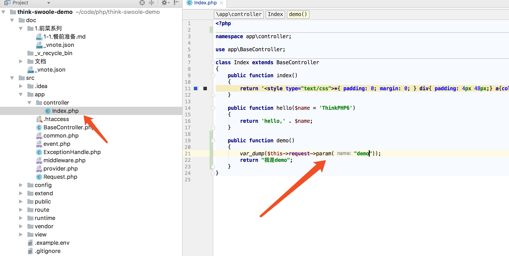
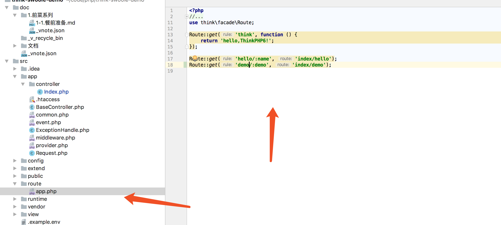
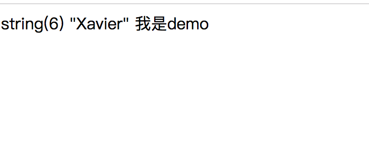
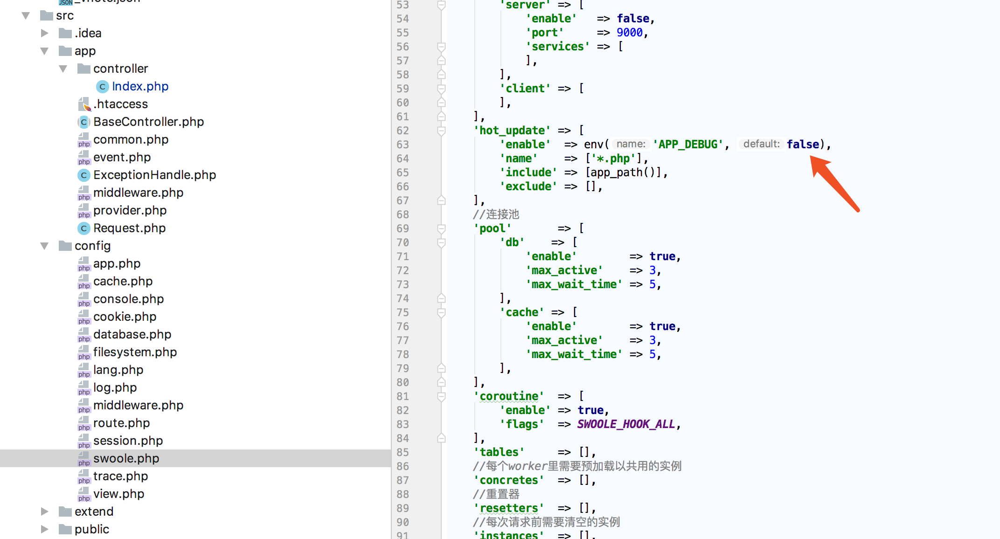

# HTTP服务

我们所使用的传统开发方式同样可以提供HTTP服务，不同的是传统模式依赖NGINX或者Apache，这里只需要PHP就可以提供服务    
本篇不做过多介绍，基于安装的介绍，我们已经可以提供基于swoole的TP，那么路由，请求等，think-swoole可以让我们无感知的从传统开发模式切换到当前开发模式，所以更多关于控制器，模型，路由配置等相关知识，请参考官方文档。    
#### 简单示例

修改默认控制器Index.php，并增加demo函数

    

增加路由配置信息    
    
接下来访问http://127.0.0.1:8882/demo/Xavier   (端口号为本项目已经默认修改为8882,官方默认80)

修改代码后，请注意重启或者开启热更新

备注：由于think-swoole运行模式为cli模式，代码启动后会常驻内存，如果未开启热更新，修改代码后，运行中的服务功能将无法改变，这也是和传统开发方式区别的地方。    
热更新需要修改如下图所示配置，生产环境建议关闭，因为热更新需要不断检测目录下文件是否修改，会造成资源浪费

