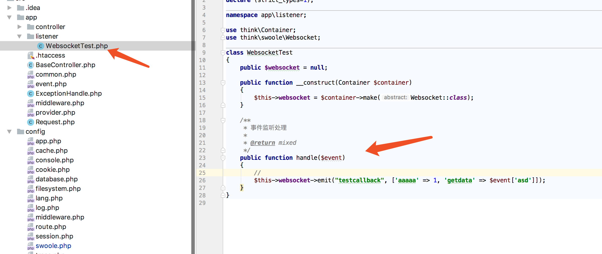

# Websocket基础使用

最近的版本和初期版本有了很大差别，其中websocket路由这块就取消了，所以Websocket的使用方式也改变了。

本章主要介绍如何使用，至于原理将会在其他文章中提及。

thinkphp6.0中新增的一项就是Event，websocket服务这块依赖于Event，因此我们需要先创建一个Event listener

```
php think make:listener WebsocketTest
```
执行过后，将会在app目录下看到新增的目录和文件    
    
其中handle是用来处理事件。参考如图进行修改

此次的前端Demo文件位于项目源码public目录下，为demo.html，socketio js 如何使用可以自行百度或者谷歌    


```php
class WebsocketTest
{
    public $websocket = null;
    /**
    * 注入容器管理类，从容器中取出Websocket类，或者也可以直接注入Websocket类，
    */
    public function __construct(Container $container)
    {
        $this->websocket = $container->make(Websocket::class);
    }

    /**
     * 事件监听处理
     *
     * @return mixed
     */
    public function handle($event)
    {
        //回复客户端消息
        $this->websocket->emit("testcallback", ['aaaaa' => 1, 'getdata' => $event['asd']]);
        //不同于HTTP模式，这里可以进行多次发送
           $this->websocket->emit("testcallback", ['aaaaa' => 1, 'getdata' => $event['asd']]);
    }
}
```
Websocket和事件是如何关联的呢？

打开config目录找到swoole.php，修改其中配置信息

```
   'websocket'  => [
        'enable'        => true,
        'handler'       => Handler::class,
        'parser'        => Parser::class,
        'ping_interval' => 25000,
        'ping_timeout'  => 60000,
        'room'          => [
            'type'  => 'table',
            'table' => [
                'room_rows'   => 4096,
                'room_size'   => 2048,
                'client_rows' => 8192,
                'client_size' => 2048,
            ],
            'redis' => [

            ],
        ],
        'listen'        => [
            'test' => \app\listener\WebsocketTest::class,  //这里将事件名称和事件处理类进行注册
        ],
        'subscribe'     => [],
    ],
    'rpc'        => [
        'server' => [
            'enable'   => false,
            'port'     => 9000,
            'services' => [
            ],
        ],
        'client' => [
        ],
    ],
```

接下来就是见证奇迹的时刻,启动服务，打开http://127.0.0.1:8882/demo.html并打开控制台，执行如下代码，就可以看到页面打印出服务器反馈的信息

```
socket.emit("test",{"asd":"我是内容"})
```