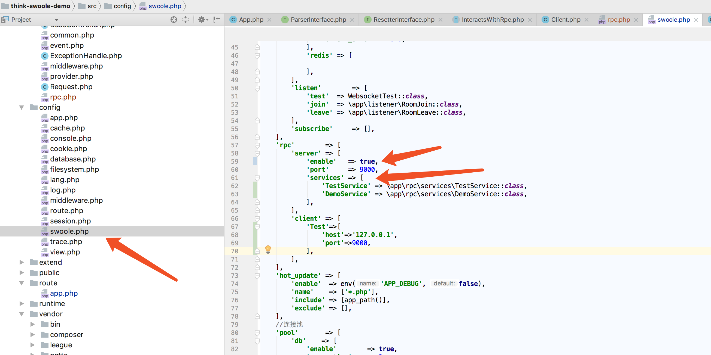
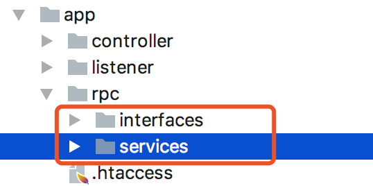

# RPC使用

RPC，即远程调用，这个功能和HTTP一样，已经历史久远，然而仍然有很多PHPER并未听说过RPC。    
RPC是一种协议，我们可以基于TCP实现，也可以基于HTTP实现，与传统的HTTP方式相比，这种调用方式更本地化，可以无感知的调用远程的服务。    
在think-swoole 3.0中也实现了该功能。

该版本基于TCP实现RPC。主要实现方式可以参考 think\swoole\rpc\client\Client

```php
<?php

namespace think\swoole\rpc\client;

use think\swoole\contract\rpc\ParserInterface;
use think\swoole\exception\RpcClientException;

/**
 * Class Client
 * @package think\swoole\rpc\client
 */
class Client
{
    protected $host;
    protected $port;
    protected $timeout;
    protected $options;

    /** @var \Swoole\Coroutine\Client */
    protected $handler;

    public function __construct($host, $port, $timeout = 0.5, $options = [])
    {
        $this->host    = $host;
        $this->port    = $port;
        $this->timeout = $timeout;
        $this->options = $options;
        $this->connect();
    }

    public function sendAndRecv(string $data, bool $reconnect = false)
    {
        if ($reconnect) {
            $this->connect();
        }

        try {
            if (!$this->send($data)) {
                throw new RpcClientException(swoole_strerror($this->handler->errCode), $this->handler->errCode);
            }

            $result = $this->handler->recv();

            if ($result === false || empty($result)) {
                throw new RpcClientException(swoole_strerror($this->handler->errCode), $this->handler->errCode);
            }

            return $result;
        } catch (RpcClientException $e) {
            if ($reconnect) {
                throw  $e;
            }
            return $this->sendAndRecv($data, true);
        }
    }

    public function send($data)
    {
        return $this->handler->send($data . ParserInterface::EOF);
    }

    protected function connect()
    {
        $client = new \Swoole\Coroutine\Client(SWOOLE_SOCK_TCP);

        $client->set([
            'open_eof_check' => true,
            'open_eof_split' => true,
            'package_eof'    => ParserInterface::EOF,
        ]);

        if (!$client->connect($this->host, $this->port, $this->timeout)) {
            throw new RpcClientException(
                sprintf('Connect failed host=%s port=%d', $this->host, $this->port)
            );
        }

        $this->handler = $client;
    }

    public function __destruct()
    {
        if ($this->handler) {
            $this->handler->close();
        }
    }
}

```    
本文不介绍RPC的原理，这里主要介绍TP-SWOOLE 3.0的RPC如何使用。

## 服务端配置

    
```php
    'rpc'        => [
        'server' => [
            'enable'   => true,  //这里是RCP服务器的开关
            'port'     => 9000,
            'services' => [
                'TestService' => \app\rpc\services\TestService::class,   //这里是提供的RPC服务内容
                'DemoService' => \app\rpc\services\DemoService::class,
            ],
        ],
        'client' => [

        ],
    ],
```    
根据上述配置，开启RPC服务

服务端基于反射获取RPC服务的接口，因而配置RPC服务，需要设置接口,至于为何必须设置接口，可以先看think\swoole\rpc\server\Dispatcher

```php
/**
     * 获取服务接口
     * @param $services
     * @throws \ReflectionException
     */
    protected function prepareServices($services)
    {
        foreach ($services as $className) {
            $reflectionClass = new ReflectionClass($className);
            $interfaces      = $reflectionClass->getInterfaceNames();

            foreach ($interfaces as $interface) {
                $this->services[class_basename($interface)] = [
                    'interface' => $interface,
                    'class'     => $className,
                ];
            }
        }
    }
```
在app目录下新建如下图所示目录
    
接下来在接口目录新建接口，服务目录新建服务，代码如下    
DemoInterface.php
```php
<?php
/**
 * Created by PhpStorm.
 * User: xavier
 * Date: 2019/12/19
 * Time: 下午3:32
 * Email:499873958@qq.com
 */

namespace app\rpc\interfaces;


interface DemoInterface
{
    public function inc($int);
}
```    
TestInterface.php
```php
<?php

/**
 * Created by PhpStorm.
 * User: xavier
 * Date: 2019/12/19
 * Time: 下午3:26
 * Email:499873958@qq.com
 */
namespace app\rpc\interfaces;

interface TestInterface
{
    public function test($name);
}
```
DemoService.php
```php
<?php
/**
 * Created by PhpStorm.
 * User: xavier
 * Date: 2019/12/19
 * Time: 下午3:32
 * Email:499873958@qq.com
 */

namespace app\rpc\services;


use app\rpc\interfaces\DemoInterface;

class DemoService implements DemoInterface
{

    public function inc($int)
    {
        // TODO: Implement inc() method.
        return ++$int;
    }
}
```
TestService.php
```php
<?php
/**
 * Created by PhpStorm.
 * User: xavier
 * Date: 2019/12/19
 * Time: 下午3:27
 * Email:499873958@qq.com
 */

namespace app\rpc\services;


use app\rpc\interfaces\TestInterface;

class TestService implements TestInterface
{

    public function test($name)
    {
        // TODO: Implement test() method.
        return $name.'asd';
    }
}
```    
然后将上述信息配置到swoole.php,添加到services字段下面
```php
'rpc'        => [
        'server' => [
            'enable'   => true,  //这里是RCP服务器的开关
            'port'     => 9000,
            'services' => [
                'TestService' => \app\rpc\services\TestService::class,   //这里是提供的RPC服务内容
                'DemoService' => \app\rpc\services\DemoService::class,
            ],
        ],
        'client' => [

        ],
    ],
```
接下来启动服务。


### 客户端配置

客户端目前仅可以运行于swoole模式。    
客户端使用RPC仅需要配置RPC服务端的地址即可。配置如下
```php
'rpc'        => [
        'server' => [
            'enable'   => true,  
            'port'     => 9000,
            'services' => [
                'TestService' => \app\rpc\services\TestService::class,  
                'DemoService' => \app\rpc\services\DemoService::class,
            ],
        ],
        'client' => [
            //这里配置信息
            'Test'=>[//这里的名字自定义，主要是标记RPC服务器的别名
                'host'=>'127.0.0.1',//目前RPC服务已经基于TCP，所以这里写IP就可以了
                'port'=>9000//RPC默认的端口为9000 ，也可以自己修改
            ]
        ],
    ],
```
接下来执行命令创建RPC客户端的接口文件
```
php think rpc:interface
```
执行命令后会在app目录下创建一个rpc.php，并会生成如下内容，可以看到服务端，我们创建的接口文件出现在了下面
```php
<?php

/**
 * This file is auto-generated.
 */

declare(strict_types=1);

namespace rpc\contract\Test;

interface TestInterface
{
	const RPC = 'Test';

	public function test($name);
}

interface DemoInterface
{
	const RPC = 'Test';

	public function inc($int);
}

```

### 客户端调用RPC

在控制器文件当中引入接口,注意DemoInterface为我们上一步生成的rpc.php文件当中的接口，需要注意命名空间
```php
<?php

namespace app\controller;

use app\BaseController;
use rpc\contract\Test\DemoInterface;

class Index extends BaseController
{


    public function testrpc(DemoInterface $demo)
    {
        return $demo->inc(1);
    }
}
```    
下面重启当前的服务，我们打开链接[http://127.0.0.1:8882/rpctest](http://127.0.0.1:8882/rpctest)

页面就会显示
