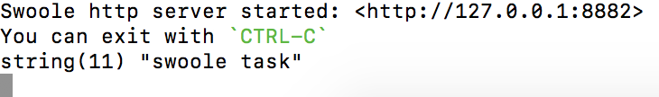

# 任务异步投递
Swoole一大亮点就是task 异步投递，think-swoole3中进行任务投递需要监听事件，一下为配置流程    

创建事件监听类
```
php think make:listener  TaskTest
```

在handle中添加代码，方便查看是否执行
```php
<?php
declare (strict_types = 1);

namespace app\listener;

class TaskTest
{
    /**
     * 事件监听处理
     *
     * @return mixed
     */
    public function handle($event)
    {
        var_dump('swoole task');
    }
}

```

在项目根目录event.php中修改配置信息 swoole.task,这样事件监听就完成了
```php
<?php
// 事件定义文件
return [
    'bind' => [

    ],

    'listen' => [
        'AppInit'  => [],
        'HttpRun'  => [],
        'HttpEnd'  => [],
        'LogLevel' => [],
        'LogWrite' => [],
        'swoole.task'   => [
            \app\listener\TaskTest::class
        ],
    ],

    'subscribe' => [
    ],

];
```

接收方法已经处理完成，下面进行任务投递,修改默认控制器，在testrpc中，注入Server，注意Server为Swoole\Server。然后执行task方法，传入内容自定义，参数内容可以在监听类的$handle中查看。
注意一些资源类型的变量无法序列化，因为不可作为参数传递，比如swoole/Server
```php

<?php

namespace app\controller;

use app\BaseController;
use rpc\contract\Test\DemoInterface;
use Swoole\Server;

class Index extends BaseController
{


    public function testrpc(DemoInterface $demo,Server $server)
    {
        $server->task(\app\event\TaskEvent::class);
        return $demo->inc(1);
    }
}

```

启动服务，请求页面[http://127.0.0.1:8882/rpctest](http://127.0.0.1:8882/rpctest)，然后查看控制台，即可看到
